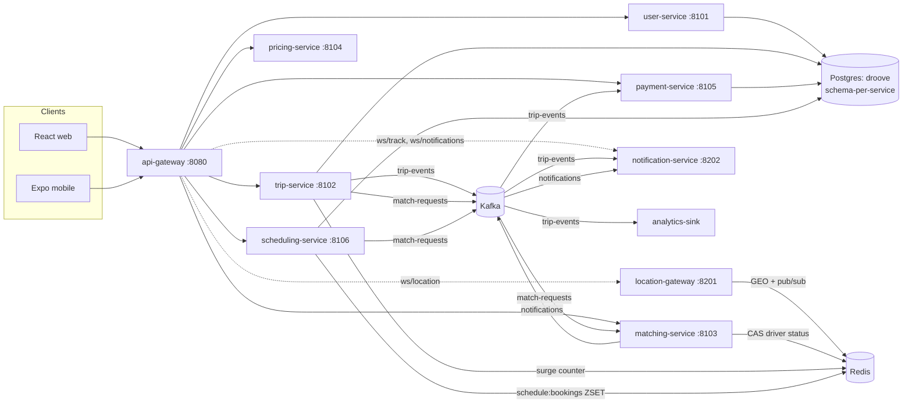
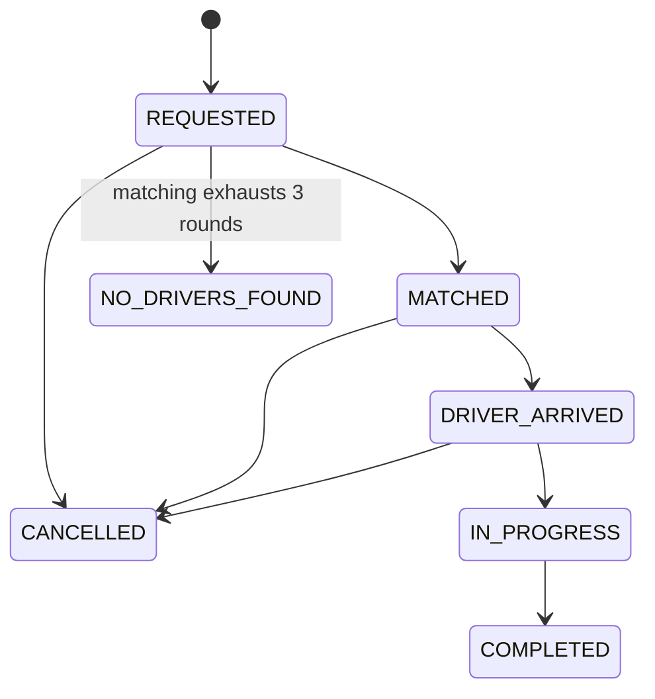

# Droove Architecture

Source of truth for all contracts (event schemas, Redis keys, API bodies, ledger model) is the §Contracts section of [`Docs/plans/2026-07-14-droove-7day.md`](plans/2026-07-14-droove-7day.md). This doc is a navigable summary — extracted, not duplicated in spirit; when they disagree, the plan wins.

## Services

## Trip state machine

## Kafka topics

| Topic | Partitions | Key | Producers → Consumers |
|---|---|---|---|
| `trip-events` | 6 | tripId | trip-service → notification-service, payment-service, analytics-sink |
| `match-requests` | 3 | tripId | trip-service, scheduling-service → matching-service |
| `notifications` | 6 | targetUserId | matching-service → notification-service |

## Redis keys

| Key | Type | Purpose |
|---|---|---|
| `drivers:geo` | GEO | nearest-driver index |
| `driver:{id}:status` | STRING, TTL 15s | liveness heartbeat (AVAILABLE/BUSY/OFFLINE) |
| `driver:pos:{id}` | pub/sub | rider live tracking |
| `schedule:bookings` | ZSET | future-booking trigger queue |
| `offers:expiry` | ZSET | offer timeout sweep |
| `offer:{offerId}` | HASH, TTL 30s | live offer state |
| `surge:{geohash5}` | INT, TTL 300s | pricing surge input |

## Auth

Gateway validates the JWT (HS256, shared `JWT_SECRET`, claims `{sub: userId, role}`), strips any client-sent `X-User-*` headers, and injects trusted `X-User-Id`/`X-User-Role` headers. Downstream services trust those headers (documented v1 tradeoff: internal network trust; mTLS is the production upgrade, not built).

See the plan's §Contracts for exact request/response bodies, the ledger model, and the matching algorithm.
