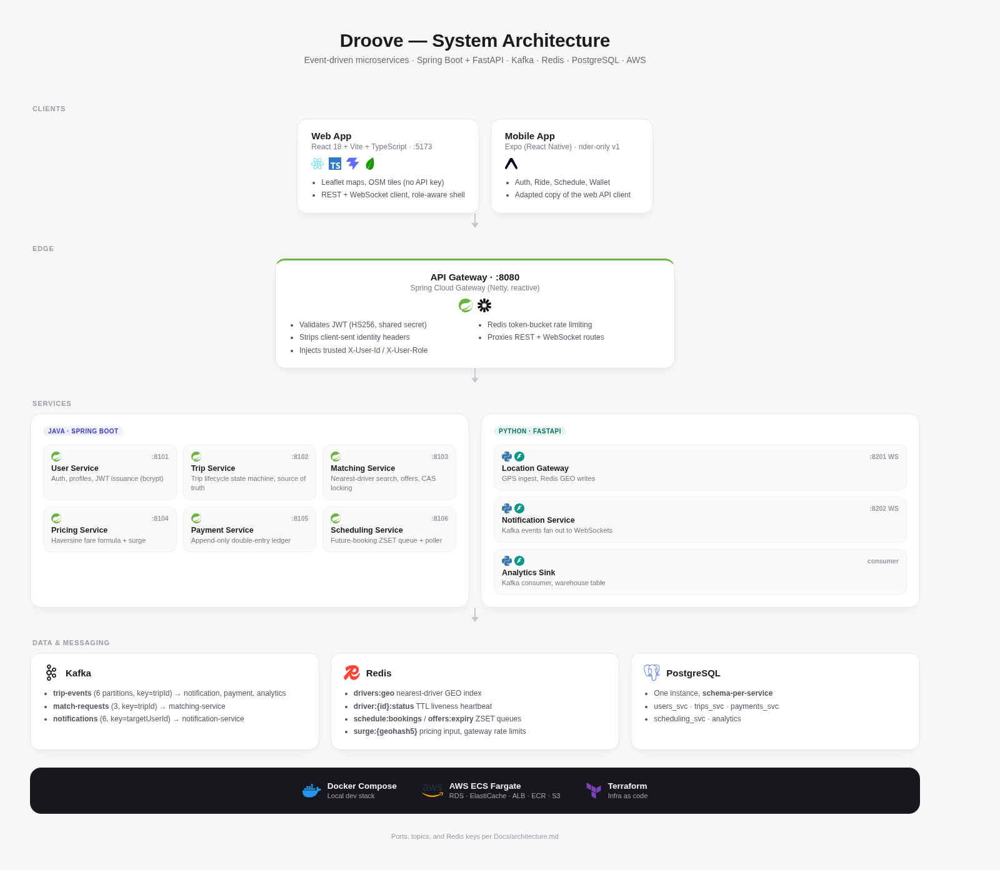

# Droove

A ride-hailing platform built as an event-driven microservice system — the kind of architecture behind Uber/Lyft, built from scratch: Spring Boot services own transactional state (users, trips, matching, pricing, payments, scheduling), FastAPI services own high-concurrency sockets (GPS ingest, notification fan-out), Kafka decouples the trip lifecycle from everything reacting to it, and Redis backs the geo index, the scheduling queue, offer expiry, and gateway rate limiting.

## Architecture



The full contract — event schemas, Redis keys, API request/response bodies, the trip state machine, the double-entry ledger model — lives in [`Docs/architecture.md`](Docs/architecture.md) (with live Mermaid diagrams). The build itself is documented service-by-service, mentor-style (business problem → design → tradeoffs → interview drills → definition of done), in [`Docs/plans/7dayplan.md`](Docs/plans/7dayplan.md).

## Tech stack

| Layer | Stack |
|---|---|
| Transactional services | Java 25 · Spring Boot 4.1 · Spring Cloud Gateway · spring-kafka |
| High-concurrency services | Python 3.12 · FastAPI · redis-py (asyncio) · aiokafka · PyJWT |
| Messaging | Apache Kafka 3.9 (KRaft, single broker) |
| Cache / geo / queues | Redis 7 |
| Database | PostgreSQL 17 (one instance, schema-per-service) |
| Web frontend | React 18 · Vite · TypeScript · Leaflet (OpenStreetMap, no API key) |
| Mobile frontend | Expo (React Native) |
| Infra | Docker Compose (local) · Terraform → AWS ECS Fargate + RDS + ElastiCache + ALB |

## Project layout

```
Droove/
├─ Services/         10 deployables: 6 Spring Boot, 3 FastAPI, 1 gateway
│  ├─ api-gateway            edge: JWT auth, rate limiting, routing
│  ├─ user-service           auth, profiles                         ✅ done
│  ├─ trip-service           trip lifecycle state machine           🚧 in progress
│  ├─ matching-service       nearest-driver search + offers
│  ├─ pricing-service        fare formula + surge
│  ├─ routing-service        road distance/ETA via GraphHopper
│  ├─ payment-service        double-entry ledger
│  ├─ scheduling-service     future-booking queue
│  ├─ location-gateway       GPS ingest (WebSocket)
│  ├─ notification-service   Kafka → WebSocket fan-out
│  └─ analytics-sink         Kafka consumer → warehouse table
├─ Frontends/
│  ├─ web/           React rider + driver app (auth, ride, schedule, wallet, drive)  ✅ UI done
│  └─ mobile/        Expo rider app
├─ Docker/           docker-compose.yml, init-db.sql
├─ Infra/terraform/  AWS deploy
├─ scripts/          smoke tests, e2e demo, GPS/traffic simulator
└─ Docs/
   ├─ architecture.md        contracts, event schemas, diagrams
   ├─ diagrams/              rendered architecture PNG(s)
   ├─ contracts/             per-topic contract extracts (reserved, not yet filled in)
   └─ plans/7dayplan.md      the mentor-style build walkthrough
```

## Status

This is a guided learning build, in progress — tracked here honestly rather than implied as finished:

| Component | Status |
|---|---|
| `user-service` | ✅ Done — register/login/me, bcrypt, JWT (HS256), tested |
| `trip-service` | 🚧 Being rewritten against the state-machine contract |
| `pricing-service` | ✅ Fare formula, min fare, surge cap — surge still reads a hardcoded 1.0 instead of Redis |
| `routing-service` | ✅ Road distance/duration/geometry via GraphHopper, with a flagged straight-line fallback |
| `matching-service`, `payment-service`, `scheduling-service` | ⬜ Scaffolded (Maven skeleton), not yet implemented |
| `location-gateway`, `notification-service`, `analytics-sink` | ⬜ Not started |
| `api-gateway` | ⬜ Skeleton only — JWT validation and rate limiting not wired |
| `Frontends/web` | 🚧 Ride screen wired to pricing + routing (live fare and drawn road route); auth, trips, wallet, schedule clients are still exercise stubs |
| Docker Compose stack | 🚧 `graphhopper` runs; Postgres, Redis and Kafka not added yet |

## Getting started

The full one-command stack isn't wired up yet (see Status above), so here's what actually runs today:

**Frontend UI** (works standalone, screens will show real errors until their backend service exists):
```bash
cd Frontends/web
npm install
npm run dev
```

**`user-service`** (needs a reachable Postgres with a `droove` database):
```bash
cd Services/user-service
cp ../../.env.example ../../.env   # fill in real secrets locally, never commit .env
./mvnw spring-boot:run
```

**Full stack, once the compose file and remaining services land:**
```bash
make up      # postgres, redis, kafka (kraft), kafka-ui
make smoke   # curl-based smoke test against the running stack
```

Each service under `Services/*` is a standalone Maven or Python project — build/run it from its own directory (`./mvnw spring-boot:run`, `uvicorn app.main:app`, etc.) until the compose stack is ready to run everything together.

## Documentation

- [`Docs/architecture.md`](Docs/architecture.md) — service map, Kafka topics, Redis keys, trip state machine, auth model
- [`Docs/plans/7dayplan.md`](Docs/plans/7dayplan.md) — the full build explained service-by-service: the business problem, why it exists, its rules, its events, common mistakes, and the interview angle for each one
