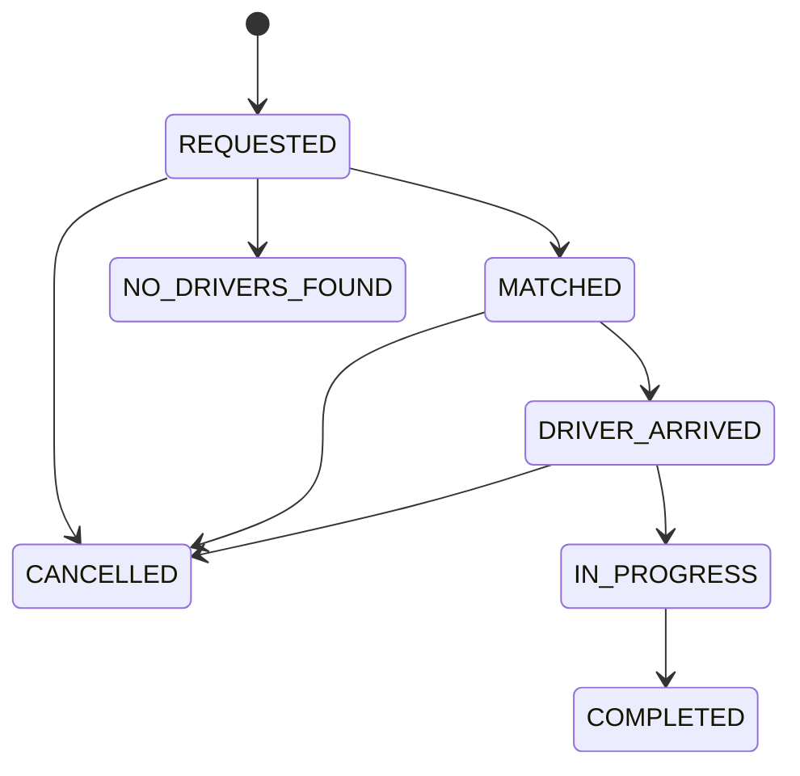

<div align="center">

# Droove

**An event-driven ride-hailing platform.**
Eleven services, three Kafka topics, one front door.

[](https://openjdk.org/)
[](https://spring.io/projects/spring-boot)
[](https://python.org)
[](https://kafka.apache.org/)
[](https://redis.io/)
[](https://postgresql.org/)

</div>

---

A rider taps a button and a stranger with a car arrives. Everything here exists to make that
one moment work reliably, for thousands of rides at once.

Droove splits that problem across eleven services, each chosen for the shape of its work:
**Spring Boot** where state must be transactional, **FastAPI** where the job is holding
thousands of open sockets, **Kafka** where something has happened and several services need to
react, **Redis** where the answer must arrive in a millisecond and is worthless in an hour.

---

## Architecture


Three layers:

- **The edge** — one gateway. It verifies identity once, so nothing behind it has to ask again.
- **The services** — each owns one slice of the business, and only that slice.
- **The infrastructure** — Postgres for what must survive, Redis for what must be fast,
  Kafka for what must be announced.

---

## How a ride works

```
1  Rider requests a ride        →  trip-service creates the trip, asks pricing for a fare
2  trip-service announces it    →  match-requests topic, keyed by trip ID
3  matching-service searches    →  Redis GEO, nearest available driver first
4  A driver is claimed          →  atomic compare-and-swap, before the offer is even sent
5  The driver accepts           →  trip-service validates the transition, moves to MATCHED
6  Everyone reacts              →  notifications push, payment holds the fare, analytics records
```

Step 6 is the design in one line: **trip-service publishes once and does not know who is
listening.** Three consumer groups read the same topic at their own pace. A fourth subscribes
without a single change upstream.

---

## Design decisions

The tradeoffs worth defending.

| Decision | Why |
|---|---|
| **Sync for questions, async for announcements** | A rider watching a spinner needs a fare *now*. Nobody is waiting on a receipt. The line falls exactly where a user is blocked. |
| **Kafka keyed by trip ID** | Order is only guaranteed within a partition. Keying by trip means a trip's events can never arrive out of sequence, while thousands of other trips flow through the same topic. |
| **Idempotent consumers, not exactly-once delivery** | Exactly-once at the transport layer is a myth in practice. At-least-once from the broker plus an idempotent consumer behaves like exactly-once, and actually ships. |
| **Compare-and-swap for driver assignment** | Two simultaneous searches will find the same nearest driver. A Lua script makes the check and the claim one indivisible operation, so exactly one rider gets him. |
| **Double-entry ledger, append-only** | A balance is derived from history, never overwritten. Every transaction's entries sum to exactly zero, so the books can be audited with one query. |
| **TTL as the liveness signal** | Silence means gone. A driver refreshes a 15-second key; the server never has to remember to check on anyone. |
| **Identity injected at the edge** | The gateway strips every client-sent `X-User-*` header before injecting the one it verified itself. Trusting a header the client set is a total authentication bypass. |
| **Money as integer cents** | `0.1 + 0.2 != 0.3` in binary floating point, and that error compounds through a ledger until a transaction fails to balance. |
| **Schema-per-service on one Postgres** | Logical isolation without paying for five database instances. Each service sees only its own tables. |

---

## Services

| Service | Port | Owns |
|---|---|---|
| `api-gateway` | 8080 | Routing, JWT verification, identity forwarding, rate limiting |
| `user-service` | 8101 | Registration, login, profiles |
| `trip-service` | 8102 | The trip lifecycle state machine — the single source of truth |
| `matching-service` | 8103 | Nearest-driver search, offers, accept/decline/timeout |
| `pricing-service` | 8104 | The fare formula and surge |
| `payment-service` | 8105 | The double-entry ledger |
| `scheduling-service` | 8106 | Future bookings and their trigger queue |
| `routing-service` | 8107 | Road distance and ETA via GraphHopper |
| `location-gateway` | 8201 | GPS ingest and live tracking over WebSockets |
| `notification-service` | 8202 | Kafka → WebSocket fan-out |
| `analytics-sink` | — | Event stream → warehouse table |

`analytics-sink` has no port. It is a worker, not a server.

---

## Contracts

**The trip lifecycle.** Enforced in one place, so the rule cannot drift between endpoints.



**The event envelope.** Versioned, because consumers deploy independently.

```json
{
  "v": 1,
  "eventId": "550e8400-e29b-41d4-a716-446655440000",
  "eventType": "TRIP_COMPLETED",
  "tripId": "…", "riderId": "…", "driverId": "…",
  "occurredAt": "2026-08-05T14:22:31Z",
  "payload": { "fareCents": 2350, "surge": 1.2 }
}
```

**The fare.**

```
fare  = max(700, round((500 + 120 × km + 30 × min) × surge))   cents
surge = clamp(1.0 + 0.2 × ⌊requests / 5⌋, 1.0, 3.0)
```

**The topics.**

| Topic | Partitions | Key | Consumers |
|---|---|---|---|
| `trip-events` | 6 | `tripId` | notification, payment, analytics |
| `match-requests` | 3 | `tripId` | matching |
| `notifications` | 6 | `targetUserId` | notification |

---

## Quick start

```bash
git clone https://github.com/3zden/Droove.git && cd Droove
cp .env.example .env          # fill in local secrets — never committed

make up                       # postgres, redis, kafka, graphhopper
make smoke                    # end-to-end check against the running stack
```

Frontend:

```bash
cd Frontends/web && npm install && npm run dev
```

Each service under `Services/*` is a standalone project and runs on its own:

```bash
cd Services/trip-service && ./mvnw spring-boot:run      # Spring Boot
cd Services/location-gateway && uvicorn app.main:app    # FastAPI
```

---

## Stack

| Layer | Choice |
|---|---|
| Transactional services | Java 25 · Spring Boot 4.1 · Spring Cloud Gateway |
| High-concurrency services | Python 3.12 · FastAPI · asyncio |
| Messaging | Apache Kafka 3.9 (KRaft) |
| Cache, geo index, queues | Redis 7 |
| Database | PostgreSQL 17, schema-per-service |
| Routing engine | GraphHopper (self-hosted OSM) |
| Web | React 18 · Vite · TypeScript · Leaflet |
| Mobile | Expo (React Native) |
| Local | Docker Compose |
| Cloud | Terraform → AWS ECS Fargate, RDS, ElastiCache, ALB |

No paid map API. Routing and tiles run on OpenStreetMap data.

---

## Layout

```
Droove/
├─ Services/          11 deployables — 8 Spring Boot, 3 Python
├─ Frontends/
│  ├─ web/            React rider + driver app
│  └─ mobile/         Expo rider app
├─ Docker/            docker-compose.yml, init-db.sql
├─ Infra/terraform/   AWS deployment
├─ scripts/           smoke tests, seeding, GPS simulator
└─ Docs/              architecture, contracts, diagrams
```

---

## Documentation

| Document | Contents |
|---|---|
| [`Docs/architecture.md`](Docs/architecture.md) | Service map, event schemas, Redis keys, auth model |
| [`Docs/plans/7dayplan.md`](Docs/plans/7dayplan.md) | Every service explained: the problem, the design, the tradeoffs |

---

<div align="center">
<sub>Built by <a href="https://github.com/3zden">3zden</a></sub>
</div>
